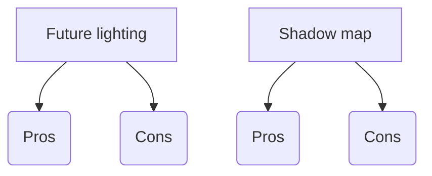
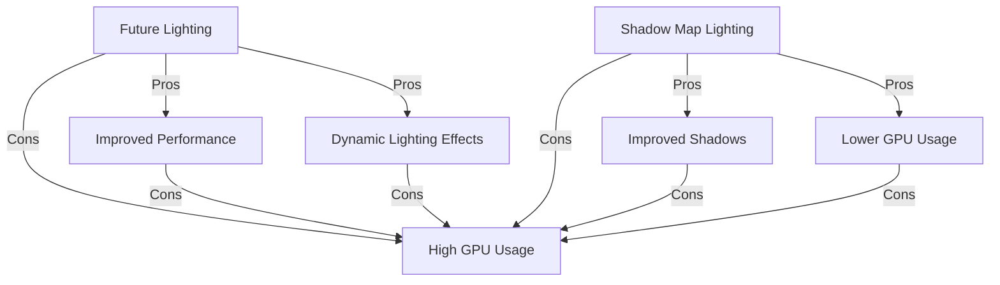
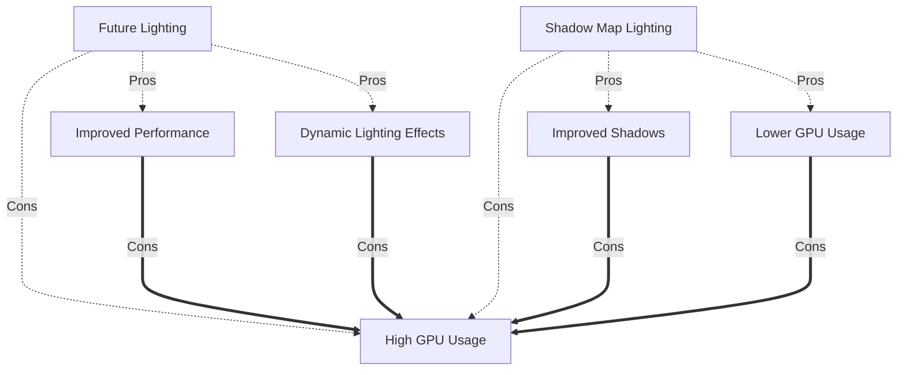
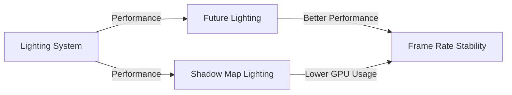
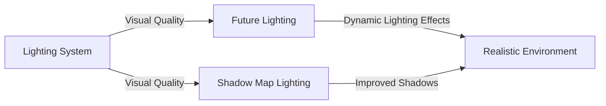
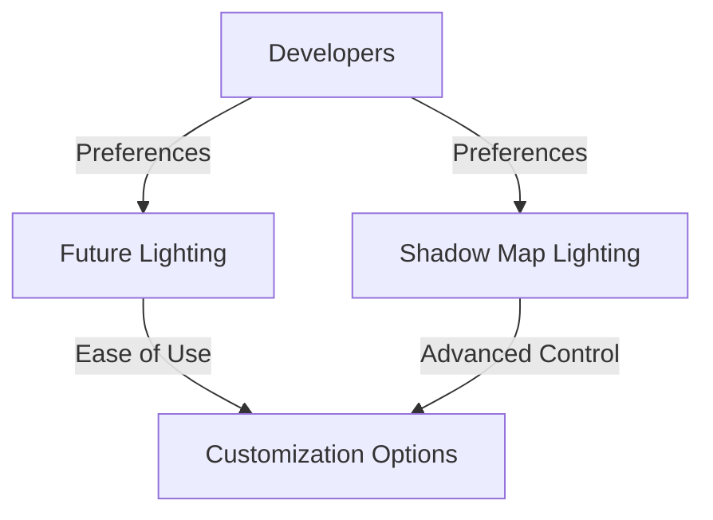

# Roblox Lighting Guide

Welcome to the Roblox Lighting Guide! This guide aims to provide an overview of the lighting system in Roblox, how it works, and tips for creating atmospheric and visually appealing environments in your games.

## Table of Contents

1. [Introduction to Roblox Lighting](#introduction-to-roblox-lighting)
2. [Types of Lights](#types-of-lights)
3. [Settings and Parameters](#settings-and-parameters)
4. [Tips for Effective Lighting](#tips-for-effective-lighting)
5. [Environmental Lighting](#Environmental-lighting)

## Introduction to Roblox Lighting

Roblox offers a powerful lighting system that allows developers to create immersive environments. Understanding how to manipulate light sources and settings can drastically improve the visual quality and atmosphere of your games.

## Types of Lights

### Ambient Lighting

Ambient lighting provides overall illumination to the scene and sets the base level of brightness.

### Point Lights

Point lights emit light in all directions from a specific point in space. They are useful for simulating light sources such as lamps or torches.

### Spotlights

Spotlights emit light in a cone-shaped direction, allowing for more focused illumination. They are great for highlighting specific areas or objects.

### Surface Lights

Surface lights emit light from a surface, such as a glowing texture or a neon sign.

## Settings and Parameters

Roblox lighting settings can be adjusted using the Properties window in Studio. Key parameters include:

- **Color**: Adjust the color of the light emitted.
- **Brightness**: Control the intensity of the light.
- **Range**: Define how far the light extends.
- **Shadow Softness**: Adjust the softness of shadows cast by the light.

Future vs. Shadow Map Lighting Comparison
Sankey Diagram: Pros and Cons
Below is a Sankey diagram illustrating the pros and cons comparison between Future and Shadow Map lighting technologies in Roblox:

### Other Aspects of Roblox Lighting
## Graph 1: Lighting Performance Comparison

### Graph 2: Visual Quality Comparison

### Graph 3: Developer Preferences

## Tips for Effective Lighting

- **Use Multiple Light Sources**: Combine different types of lights to create depth and realism.
- **Experiment with Colors**: Use contrasting colors to create mood and atmosphere.
- **Utilize Shadows**: Shadows add depth to your scenes and enhance realism.
- **Consider Time of Day**: Adjust lighting settings to simulate different times of day or weather conditions.

- ## Environmental lighting
- **THE BEST METHOD TO IMPROVE LIGHTING IS AND ALWAYS WILL BE TO CHANGE LIGHTING TO FUTURE TECHNOLOGY**

