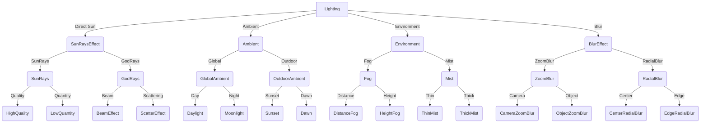
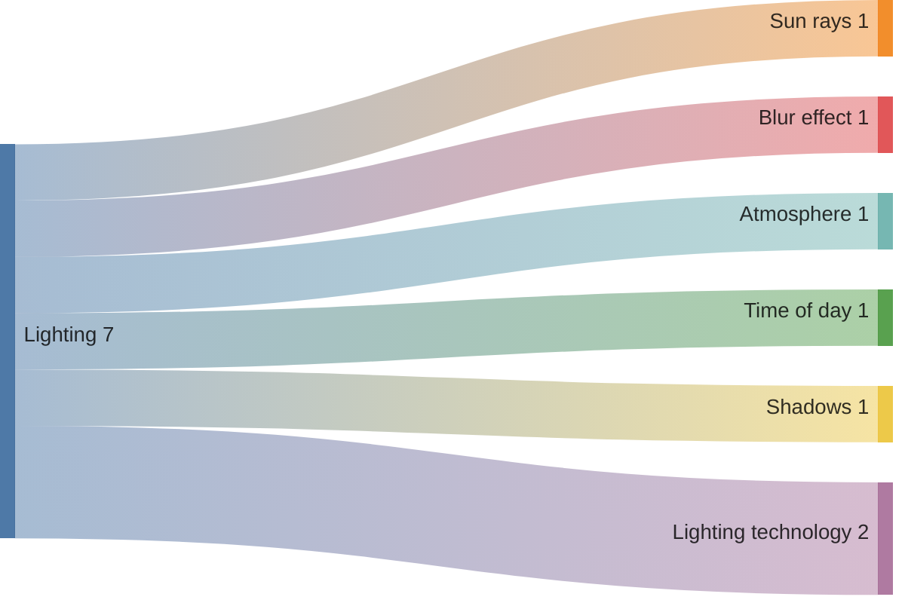
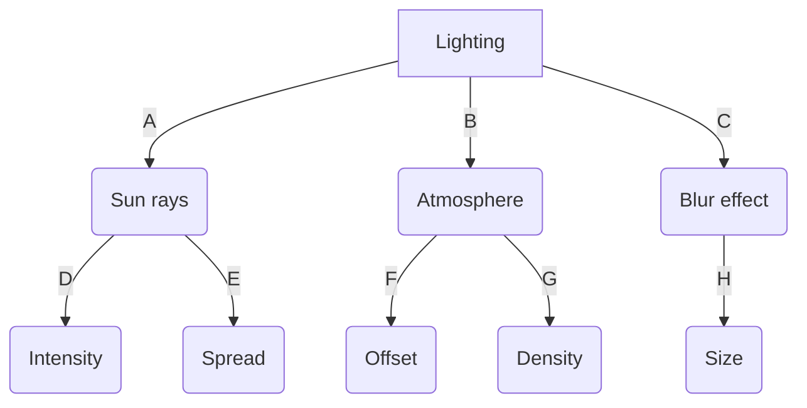

# Realism-in-Roblox

## At its core, realism in Roblox encompasses several facets. One prominent aspect is the graphical fidelity and attention to detail in game design. Developers utilize advanced scripting techniques and high-quality assets to create environments that mimic real-world locations or historical settings. Whether it's a bustling cityscape with skyscrapers towering overhead, or a serene countryside dotted with farms and rolling hills, the visual realism in Roblox adds depth and immersion to the gameplay.

## Moreover, realism extends beyond visuals to include gameplay mechanics and simulations. Many games within Roblox incorporate realistic physics, weather systems, and day-night cycles, which enhance the authenticity of the virtual experience. For instance, driving simulations may feature realistic vehicle handling and road conditions, while survival games might simulate hunger, thirst, and environmental hazards.

## Every Roblox game's approach to realism is different is what I am trying to say, in my opinion, In roblox there are mainly 3 things that create true lighting.

# Lighting 

## Lighting in Roblox plays a crucial role in creating atmosphere, setting moods, and enhancing the visual appeal of games or experiences created within the platform. Here's a detailed explanation of how lighting works in Roblox:

### 1. Lighting System Basics
#### Ambient Light: This is the general, non-directional light that fills the environment uniformly. It sets the overall brightness and affects the visibility of objects in dark areas.

#### Directional Light: Mimicking sunlight or a dominant light source, directional light casts shadows and creates highlights and shadows based on its position and angle.

#### Point Lights: These are localized light sources that emit light in all directions from a specific point. They can simulate light bulbs, torches, or other small light sources.

#### Spotlights: These lights emit light in a specific direction, forming a cone-shaped beam. They are useful for highlighting specific areas or creating dramatic effects.

## (A) Sun rays
### Sun rays in Roblox are achieved through the use of a specific type of lighting called "God Rays" or "Sun Rays" effects.
### These effects are usually applied to a directional light source, such as the sun in the game's skybox.
### The rays are rendered as streaks or beams of light that become more visible when looking towards the light source (e.g., the sun).

## (B) Atmosphere
### Atmosphere has 2 properties inside "Appearance" which are :
## Density : This property if changed increase the "fog" inside of the game.
## Offset  : Controls how light transmits between the camera and the sky background. Increase this value to create a horizon silhouette against the sky or reduce it to blend distant objects into the sky for an endless and seamless open world.

### Offset should be balanced against Atmosphere.Density and carefully tested in your place. A low offset may cause "ghosting" where the skybox can be seen through objects/terrain. This can be corrected by increasing the offset, which more clearly silhouettes distant objects/terrain against the sky, but too much offset may reveal level-of-detail "popping" for far distant terrain and meshes.

## Proportionality

## (C) Blur effect
### The BlurEffect applies a Gaussian blur to the entire rendered game world. The strength of the blur is controlled by the BlurEffect.Size. Only one BlurEffect can be applied at once (the instance with the greatest Size takes priority).

## Like other post-processing effects, BlurEffect will only work while Enabled and when parented to Lighting or Workspace.CurrentCamera. Also, it may render differently on low-end devices and/or depending on your Studio settings (see the Quality Level settings in Rendering → Performance).

